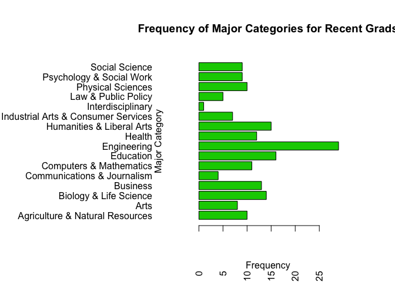

# MSDS 6306 Tibbett 402 Week 4 HW
Noah Horowitz  
9/24/2017  


#1. FiveThirtyEight Data (30 points): Navigate on GitHub to https://github.com/rudeboybert/fivethirtyeight and read README.md. Seriously, it will include every command you need. Test out some commands on R.
##A. Install the fivethirtyeight package.

```r
#install.packages('fivethirtyeight')
library(fivethirtyeight)
```

##B. In the listing of Data sets in package ‘fivethirtyeight,’ assign the eighteenth data set to an object ‘df.’

```r
setwd("/Users/noahhorowitz/git_repositories/SMU-DDS-HW/Homework")
#18th list is college_recent_grads
df <- college_recent_grads
```

##C. Use a more detailed list of the data sets to write out the URL in a comment to the related news story.

```r
#use vignette command to view detailed list of datasets and find the url
#vignette("fivethirtyeight", package = "fivethirtyeight")
#http://fivethirtyeight.com/features/the-economic-guide-to-picking-a-college-major/
```

##D. Using R command(s), give the dimensions and column names of this data frame.

```r
#list number of rows and columns
dim(df)
```

```
## [1] 173  21
```

```r
#list the column names
names(df)
```

```
##  [1] "rank"                        "major_code"                 
##  [3] "major"                       "major_category"             
##  [5] "total"                       "sample_size"                
##  [7] "men"                         "women"                      
##  [9] "sharewomen"                  "employed"                   
## [11] "employed_fulltime"           "employed_parttime"          
## [13] "employed_fulltime_yearround" "unemployed"                 
## [15] "unemployment_rate"           "p25th"                      
## [17] "median"                      "p75th"                      
## [19] "college_jobs"                "non_college_jobs"           
## [21] "low_wage_jobs"
```

#2. Data Summary (30 points): Use your newly assigned data frame for Question 2.
##A. Write an R command that gives you the column names of the data frame. Right after that, write one that counts the number of columns but not rows. Hint: The number should match one of your numbers in Question 1d for dimensions.

```r
#show the names and total number of columns in the dataframe
names(df)
```

```
##  [1] "rank"                        "major_code"                 
##  [3] "major"                       "major_category"             
##  [5] "total"                       "sample_size"                
##  [7] "men"                         "women"                      
##  [9] "sharewomen"                  "employed"                   
## [11] "employed_fulltime"           "employed_parttime"          
## [13] "employed_fulltime_yearround" "unemployed"                 
## [15] "unemployment_rate"           "p25th"                      
## [17] "median"                      "p75th"                      
## [19] "college_jobs"                "non_college_jobs"           
## [21] "low_wage_jobs"
```

```r
ncol(df)
```

```
## [1] 21
```
##B. Generate a count of each unique major_category in the data frame. I recommend using libraries to help. I have demonstrated one briefly in live-session. To be clear, this should look like a matrix or data frame containing the major_category and the frequency it occurs in the dataset. Assign it to major_count.

```r
#use the count command from the plyr package to summarize major_category
library(plyr)
major_count <- count(df$major_category)
major_count
```

```
##                                      x freq
## 1      Agriculture & Natural Resources   10
## 2                                 Arts    8
## 3               Biology & Life Science   14
## 4                             Business   13
## 5          Communications & Journalism    4
## 6              Computers & Mathematics   11
## 7                            Education   16
## 8                          Engineering   29
## 9                               Health   12
## 10           Humanities & Liberal Arts   15
## 11 Industrial Arts & Consumer Services    7
## 12                   Interdisciplinary    1
## 13                 Law & Public Policy    5
## 14                   Physical Sciences   10
## 15            Psychology & Social Work    9
## 16                      Social Science    9
```
##C. To make things easier to read, enter par(las=2) before your plot to make the text perpendicular to the axis. Make a barplot of major_count. Make sure to label the title with something informative (check the vignette if you need), label the x and y axis, and make it any color other than grey. Assign the major_category labels to their respective bar. Flip the barplot horizontally so that bars extend to the right, not upward. All of these options can be done in a single pass of barplot(). Note: It’s okay if it’s wider than the preview pane. 

```r
#make text perpendicular to the axis and set plot margins
par(las=2, mai=c(1,3.5,1,1))
#make a barplot major category frequency
barplot(major_count$freq, names.arg = major_count$x,
        #set color
        col=3, 
        #set main and axis titles
        main='Frequency of Major Categories for Recent Grads', 
        ylab = 'Major Category', 
        xlab = 'Frequency',
        #make columns horizontal
        horiz = TRUE, 
        mgp=c(3,4,0))
```

<!-- -->

##D. Write the fivethirtyeight data to a csv file. Make sure that it does not have row labels.

```r
#write the data to a csv file without row names
write.csv(df, file = 'fivethirtyeight.recent.college.grads.csv', row.names = FALSE)
```

#3. Codebook (30 points):
##A. Start a new repository on GitHub for your SMU MSDS homework. On your local device, make sure there is a directory for Homework at the minimum; you are welcome to add whatever you would like to this repo in addition to your requirements here.
##B. Create a README.md file which explains the purpose of the repository, the topics included, the sources for the material you post, and contact information in case of questions. Remember, the one in the root directory should be general. You are welcome to make short READMEs for each assignment individually in other folders.
##C. In one (or more) of the nested directories, post your RMarkdown script, HTML file, and data from ‘fivethirtyeight.’ Make sure that in your README or elsewhere that you credit fivethirtyeight in some way.
##D. In your RMarkdown script, please provide the link to this GitHub so the grader can see it.

```r
#https://github.com/noahh4/SMU-DDS-HW/tree/master/Homework
```
